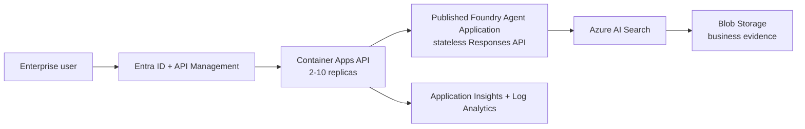

# Invoice Risk Validation Workflow

A production-oriented Microsoft Foundry workflow for validating invoices against contracts, amendments, purchase orders, approval emails, SLAs, complaints, incident reports, and duplicate records.

All repository data is synthetic. The workflow produces a payment **recommendation** and always requires human approval.

## Demo Video

Watch the project demo here: https://drive.google.com/file/d/1JD4d1PDyUokmOTb_sph1ecgpjowByS-V/view?usp=sharing

## What Is Included

- Nine versioned Foundry agent instructions and workflow guardrails
- Structured result schemas and synthetic evaluation scenarios
- A stateless FastAPI gateway for a published Foundry Agent Application
- A Streamlit demonstration client
- Azure Container Apps Bicep with managed identity, autoscaling, health probes, logs, and telemetry
- CI, CodeQL, Dependabot, API tests, and a Locust load test
- Production, security, and Foundry publishing runbooks

## Architecture



The workflow contains:

1. Invoice Intake Agent
2. Contract Matching Agent
3. Amendment Resolution Agent
4. Purchase Order Matching Agent
5. Approval Email Verification Agent
6. SLA and Service Credit Agent
7. Duplicate Invoice Detection Agent
8. Final Invoice Risk and Decision Agent
9. Executive Invoice Summary Agent

## Run Locally

Prerequisites: Python 3.12 and Azure credentials with **Azure AI User** access to the published Agent Application.

```powershell
cd app
python -m venv .venv
.\.venv\Scripts\Activate.ps1
pip install -r requirements-dev.txt
Copy-Item .env.example .env
# Set FOUNDRY_AGENT_ENDPOINT in .env, then:
uvicorn invoice_api.main:app --reload
```

In another terminal:

```powershell
$env:INVOICE_API_URL = "http://localhost:8000"
streamlit run app/streamlit_app.py
```

API request:

```http
POST /v1/validations
Content-Type: application/json

{"invoice_number":"INV-2026-014"}
```

## Deploy

Build and push [app/Dockerfile](app/Dockerfile), then deploy [infra/main.bicep](infra/main.bicep). See:

- [Publish the Foundry workflow](docs/foundry-publishing.md)
- [Publish the repository to GitHub](docs/github-publishing.md)
- [Azure deployment](infra/README.md)
- [Production readiness for 100 concurrent users](docs/production-readiness.md)
- [Security policy](SECURITY.md)

The supplied scaling configuration gives the API tier capacity for 100 concurrent requests. You must load-test the complete workflow and secure sufficient Foundry model and Azure AI Search quota before calling the system production ready.

## Repository Structure

```text
agents/           Versioned Foundry agent instructions
app/              FastAPI service, Streamlit client, and tests
architecture/     Architecture and workflow design
docs/             Publishing and production runbooks
infra/            Azure Container Apps Bicep deployment
outputs/          Synthetic example outputs
sample-data/      Synthetic business documents
tests/load/       100-user Locust load test
workflow/         Prompts, mappings, schemas, and guardrails
```

## Security

Do not commit real invoices, contracts, emails, customer data, tokens, secrets, connection strings, or production traces. Use Entra ID, managed identities, least-privilege RBAC, and private networking according to enterprise policy.

## License

See [LICENSE](LICENSE).
