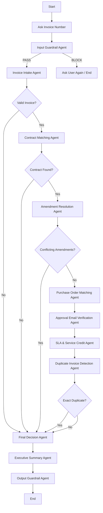

# Workflow Diagram

```mermaid
flowchart TD
    A[Start] --> B[Ask Invoice Number]
    B --> C[Input Guardrail Agent]
    C -->|PASS| D[Invoice Intake Agent]
    C -->|BLOCK| Z[Ask User Again / End]

    D --> E{Valid Invoice?}
    E -->|No| L[Final Decision Agent]
    E -->|Yes| F[Contract Matching Agent]

    F --> G{Contract Found?}
    G -->|No| L
    G -->|Yes| H[Amendment Resolution Agent]

    H --> I{Conflicting Amendments?}
    I -->|Yes| L
    I -->|No| J[Purchase Order Matching Agent]

    J --> K[Approval Email Verification Agent]
    K --> M[SLA & Service Credit Agent]
    M --> N[Duplicate Invoice Detection Agent]

    N --> O{Exact Duplicate?}
    O -->|Yes| L
    O -->|No| L

    L --> P[Executive Summary Agent]
    P --> Q[Output Guardrail Agent]
    Q --> R[End]
```
